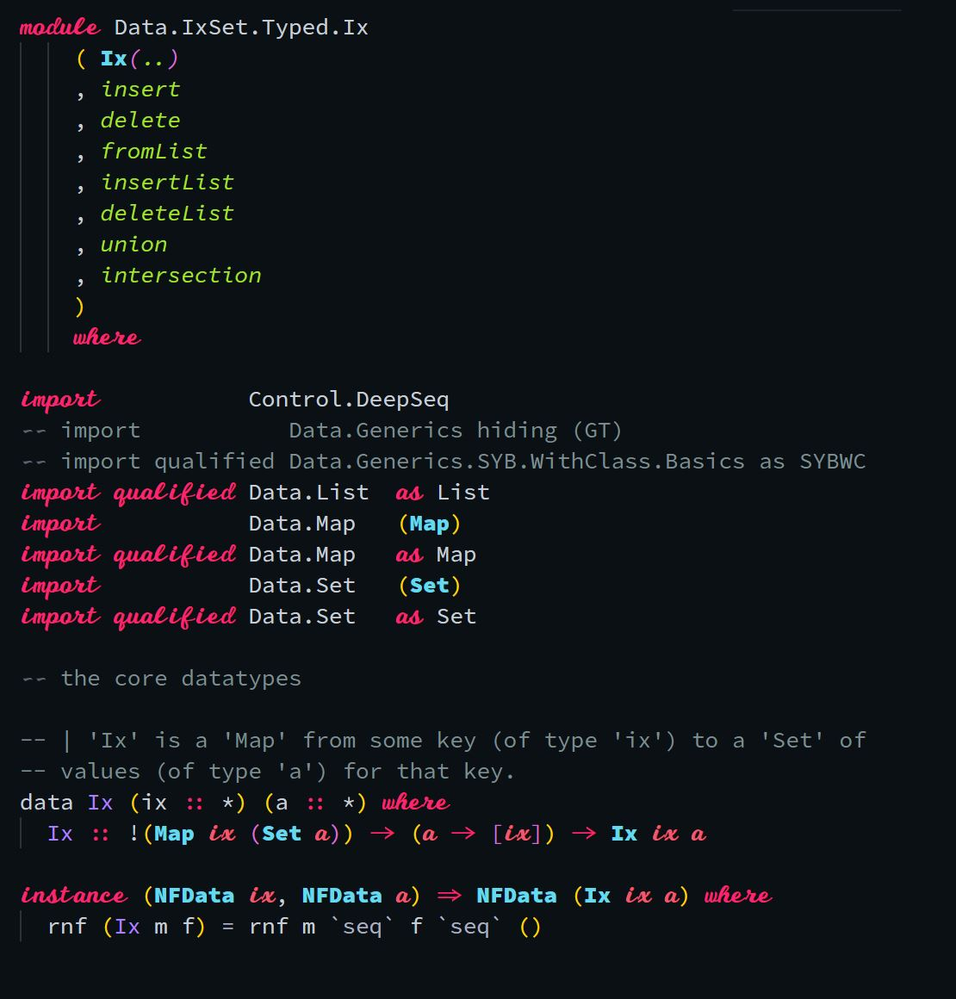

# HaskRiptLig

A font mashup to be used in code editors, displaying a script typeface for the italic font style.

The Regular and Bold face styles are taken from [Hasklig](https://github.com/i-tu/Hasklig) and [Script12](https://www.myfontsfree.com/134618/script12pitchbt.htm) modified for better monospace behavior and some specific adjustments.

Unlike similar mashups I've seen, this one allows you to get 'normal' Italic typeface from the primary font (Hasklig) by using 'Bold Italic'.

## Install

Download or clone this repository and install the fonts on your system.

In your editor of choice set the font to `HaskRiptLig`.  Also, ensure that the current theme and syntax highlighting utilize italic, or better yet italic and bold-italic.
